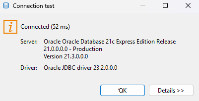
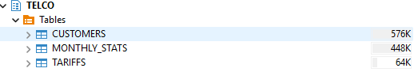
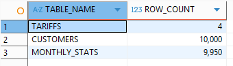
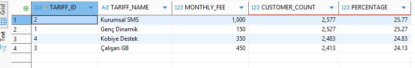

# Telco Project – Setup Guide

> **i2i Systems** · Oracle XE 21c · Docker · DBeaver

This guide walks you through every step required to reproduce the database
environment from scratch: spinning up Oracle XE in Docker, connecting DBeaver,
importing the CSV files, and running the solution queries.

---

## Table of Contents

1. [Prerequisites](#1-prerequisites)
2. [Repository Setup](#2-repository-setup)
3. [Start Oracle XE with Docker Compose](#3-start-oracle-xe-with-docker-compose)
4. [Verify the Container](#4-verify-the-container)
5. [Connect DBeaver to Oracle XE](#5-connect-dbeaver-to-oracle-xe)
6. [Import CSV Data](#6-import-csv-data)
7. [Run the Solution Queries](#7-run-the-solution-queries)
8. [Stopping & Cleaning Up](#8-stopping--cleaning-up)
9. [Troubleshooting](#9-troubleshooting)

---

## 1. Prerequisites

Install the following tools before proceeding.

| Tool | Version | Download |
|---|---|---|
| Docker Desktop | 4.x or later | https://www.docker.com/products/docker-desktop/ |
| Docker Compose | bundled with Docker Desktop | – |
| DBeaver Community | 24.x or later | https://dbeaver.io/download/ |
| Git | any recent | https://git-scm.com/ |

> **Windows users:** Make sure the WSL 2 backend is enabled in Docker Desktop
> settings before continuing.

---

## 2. Repository Setup

### 2.1 Clone the repository

```bash
git clone https://github.com/yourusername/telco-project.git
cd telco-project
```

### 2.2 Create your local environment file

The `.env` file holds database credentials and port numbers.
It is listed in `.gitignore` and must **never** be committed.

```bash
# Linux / macOS
cp .env.example .env

# Windows (PowerShell)
Copy-Item .env.example .env
```

Open `.env` in any text editor and adjust the values if needed:

```
ORACLE_SYS_PASSWORD=TelcoAdmin2025!
ORACLE_APP_USER=telco
ORACLE_APP_PASSWORD=Telco2025!
ORACLE_PORT=1521
ORACLE_EM_PORT=5500
```

> **Tip:** If port 1521 is already in use on your machine, change
> `ORACLE_PORT` to any free port (e.g. `1522`).

---

## 3. Start Oracle XE with Docker Compose

```bash
docker compose up -d
```

What happens in the background:

1. Docker pulls the `gvenzl/oracle-xe:21-slim-faststart` image (~2 GB, one-time download).
2. A named volume `telco-oracle-data` is created to persist the database files.
3. The container creates the `telco` application schema automatically.
4. Every `.sql` file inside `docker/init/` is executed in alphabetical order —
   `01_create_tables.sql` runs here, so all three tables are ready before
   you even open DBeaver.

### Watch the initialisation logs

```bash
docker compose logs -f oracle-xe
```

Wait until you see a line similar to:

```
DATABASE IS READY TO USE!
```

First-boot initialisation typically takes **60 – 120 seconds** depending on
your machine. Subsequent starts are much faster (< 15 s) because the data
volume already exists.

---

## 4. Verify the Container

### 4.1 Check container health

```bash
docker compose ps
```

Expected output:

```
NAME               IMAGE                              STATUS                   PORTS
telco-oracle-xe    gvenzl/oracle-xe:21-slim-faststart Up (healthy)   0.0.0.0:1521->1521/tcp
```

The `(healthy)` status confirms that Oracle is accepting connections.


### 4.2 Quick smoke-test from inside the container

```bash
docker exec -it telco-oracle-xe sqlplus telco/Telco2025!@//localhost:1521/XEPDB1
```

Once connected, verify the tables were created:

```sql
SELECT TABLE_NAME FROM USER_TABLES ORDER BY TABLE_NAME;
```

Expected output:

```
TABLE_NAME
-----------
CUSTOMERS
MONTHLY_STATS
TARIFFS
```

Type `EXIT` to quit SQL*Plus.

---

## 5. Connect DBeaver to Oracle XE

### 5.1 Open the New Connection wizard

In DBeaver: **Database → New Database Connection** (or press `Ctrl + Shift + N`).

Select **Oracle** from the list and click **Next**.

### 5.2 Fill in the connection details

| Field | Value |
|---|---|
| **Connection Type** | Service Name |
| **Host** | `localhost` |
| **Port** | `1521` *(or the value of `ORACLE_PORT` in your `.env`)* |
| **Service Name** | `XEPDB1` |
| **Authentication** | Database Native |
| **Username** | `telco` |
| **Password** | `Telco2025!` *(value of `ORACLE_APP_PASSWORD`)* |

> **Do not** connect as `SYS` or `SYSTEM` for day-to-day work.
> The `telco` schema owns all project tables.

### 5.3 Download the Oracle JDBC driver (first time only)

If DBeaver shows a **"Driver files are missing"** banner, click
**Download** and wait for the automatic download to finish.

### 5.4 Test the connection

Click **Test Connection**. A green checkmark and "Connected" confirm success.



Click **Finish** to save the connection.

### 5.5 Verify tables in DBeaver

In the **Database Navigator** panel:

```
telco-oracle-xe
  └── Oracle
        └── XEPDB1
              └── Schemas
                    └── TELCO
                          └── Tables
                                ├── CUSTOMERS
                                ├── MONTHLY_STATS
                                └── TARIFFS
```



---

## 6. Import CSV Data

DBeaver's built-in **Data Import** wizard handles all three CSV files.
Repeat steps 6.1 – 6.4 for each file in the order shown below.

> **Import order matters** because of foreign-key constraints:
> `TARIFFS` → `CUSTOMERS` → `MONTHLY_STATS`

---

### 6.1 Import `TARIFFS.csv`

1. Right-click the **TARIFFS** table in the Database Navigator.
2. Choose **Import Data**.
3. Select **CSV** as the source format and click **Next**.
4. Click the folder icon and browse to `TARIFFS.csv` in the project root.
5. Click **Next** to reach the column mapping screen.

**Column mapping for TARIFFS:**

| CSV Column | DB Column | Type |
|---|---|---|
| TARIFF_ID | TARIFF_ID | NUMBER |
| NAME | NAME | VARCHAR2 |
| MONTHLY_FEE | MONTHLY_FEE | NUMBER |
| DATA_LIMIT | DATA_LIMIT | NUMBER |
| MINUTE_LIMIT | MINUTE_LIMIT | NUMBER |
| SMS_LIMIT | SMS_LIMIT | NUMBER |

6. Click **Next → Proceed**.

---

### 6.2 Import `CUSTOMERS.csv`

1. Right-click **CUSTOMERS** → **Import Data** → **CSV**.
2. Browse to `CUSTOMERS.csv`.
3. On the **Settings** tab, set:
   - **Column delimiter:** `,`
   - **Quote character:** `"`
   - **Header row:** ✅ enabled (first row contains column names)

4. Proceed to column mapping:

**Column mapping for CUSTOMERS:**

| CSV Column | DB Column | Type | Notes |
|---|---|---|---|
| CUSTOMER_ID | CUSTOMER_ID | NUMBER | |
| NAME | NAME | VARCHAR2 | |
| CITY | CITY | VARCHAR2 | |
| SIGNUP_DATE | SIGNUP_DATE | DATE | ⚠ see date format note below |
| TARIFF_ID | TARIFF_ID | NUMBER | |

> **Date format note:** SIGNUP_DATE values are in `DD/MM/YYYY` format.
> In the column mapping dialog, click on the SIGNUP_DATE row and set the
> **Format** field to `dd/MM/yyyy`. Without this, Oracle will reject the dates.

5. Click **Next → Proceed**. This file has 10 000 rows; import takes a few seconds.

---

### 6.3 Import `MONTHLY_STATS.csv`

1. Right-click **MONTHLY_STATS** → **Import Data** → **CSV**.
2. Browse to `MONTHLY_STATS.csv`.

**Column mapping for MONTHLY_STATS:**

| CSV Column | DB Column | Type |
|---|---|---|
| ID | ID | NUMBER |
| CUSTOMER_ID | CUSTOMER_ID | NUMBER |
| DATA_USAGE | DATA_USAGE | NUMBER |
| MINUTE_USAGE | MINUTE_USAGE | NUMBER |
| SMS_USAGE | SMS_USAGE | NUMBER |
| PAYMENT_STATUS | PAYMENT_STATUS | VARCHAR2 |

3. Click **Next → Proceed**. This file has ~9 950 rows.

---

### 6.4 Verify row counts

Open a new SQL editor (` Ctrl + ] `) and run:

```sql
SELECT 'TARIFFS'       AS TBL, COUNT(*) AS ROWS FROM TARIFFS
UNION ALL
SELECT 'CUSTOMERS',             COUNT(*)         FROM CUSTOMERS
UNION ALL
SELECT 'MONTHLY_STATS',         COUNT(*)         FROM MONTHLY_STATS;
```

Expected output:

```
TBL             ROWS
-----------  -------
TARIFFS            4
CUSTOMERS      10000
MONTHLY_STATS   9950
```

> The exact MONTHLY_STATS count depends on how many records the insertion
> error removed. The number will be slightly less than 10 000.



---

## 7. Run the Solution Queries

Open `sql/SOLUTIONS.sql` in DBeaver:

1. **File → Open File** → navigate to `sql/SOLUTIONS.sql`.
2. Make sure the active connection (top-left of the editor) is set to
   `telco-oracle-xe / XEPDB1 / telco`.
3. Run each query individually by placing your cursor inside the block and
   pressing `Ctrl + Enter`, or select the entire file and press
   `Ctrl + Shift + Enter` to run all statements at once.



### Query reference

| Query | Description |
|---|---|
| **1.1** | Customers on 'Kobiye Destek' tariff |
| **1.2** | Newest subscriber on 'Kobiye Destek' |
| **2.1** | Tariff distribution with percentages |
| **3.1** | Customers with the earliest signup date |
| **3.2** | City distribution of earliest customers |
| **4.1** | Customer IDs with missing monthly records |
| **4.2** | City distribution of missing-record customers |
| **5.1** | Customers at ≥ 75 % data usage |
| **5.2** | Customers who exhausted all package limits |
| **6.1** | Customers with UNPAID or LATE fees |
| **6.2** | Payment status distribution across tariffs |

---

## 8. Stopping & Cleaning Up

### Stop the container (data is preserved)

```bash
docker compose stop
```

### Start it again later

```bash
docker compose start
```

### Remove the container but keep the data volume

```bash
docker compose down
```

### Full teardown (removes container AND all database data)

```bash
docker compose down -v
```

> ⚠ The `-v` flag permanently deletes the `telco-oracle-data` volume.
> You will need to re-import all CSV data if you bring the container back up.

---

## 9. Troubleshooting

### Container exits immediately / never becomes healthy

```bash
docker compose logs oracle-xe | tail -50
```

Common causes:
- **Not enough memory:** Oracle XE needs at least **1 GB RAM** allocated to
  Docker. Open Docker Desktop → Settings → Resources and raise the memory limit.
- **Port conflict:** Change `ORACLE_PORT` in `.env` and run
  `docker compose up -d` again.

---

### ORA-01017: invalid username/password

- Double-check that `ORACLE_APP_USER` and `ORACLE_APP_PASSWORD` in your `.env`
  match the values in DBeaver's connection dialog.
- Credentials are set **only on the first boot**. If you changed them after the
  volume was already created, run a full teardown (`docker compose down -v`)
  and restart.

---

### Date import errors (ORA-01843 / ORA-01858)

- Confirm the date format in DBeaver's column mapping dialog is `dd/MM/yyyy`
  (case-sensitive: lowercase `dd` and `MM`).
- Alternatively, run the following in a SQL editor before importing:
  ```sql
  ALTER SESSION SET NLS_DATE_FORMAT = 'DD/MM/YYYY';
  ```

---

### ORA-02291: integrity constraint violated (FK)

- You attempted to import `CUSTOMERS` before `TARIFFS`, or `MONTHLY_STATS`
  before `CUSTOMERS`. Re-import in the correct order:
  `TARIFFS` → `CUSTOMERS` → `MONTHLY_STATS`.

---

### Turkish characters appear as `?` or garbled text

- Verify the Oracle XE container is using the `AL32UTF8` character set
  (it is the default for `gvenzl/oracle-xe`).
- In DBeaver connection properties, set **charset = UTF-8** under
  **Driver Properties → oracle.jdbc.defaultNChar = true**.

---

### `docker compose` command not found

Older Docker installations use `docker-compose` (with a hyphen) instead of
`docker compose` (with a space). Try:

```bash
docker-compose up -d
```

---

*For questions or issues, open a GitHub Issue in your repository.*